# AREP microservice proxy implementation

This is a partial when we have to implement a microservces architecture 


So the idea is having a three EC2 instances, two instances working as math services and one EC2-Proxy service which is going to handle the browser petitions and balancing using a balancing algorithm the petitions given a case that any of all the instances are not working. 

# Local Deployment

First we must create the two services, the mathservices and the proxy service, for this, we are going to use springboot initializer because it is going to let us add the dependencies easily

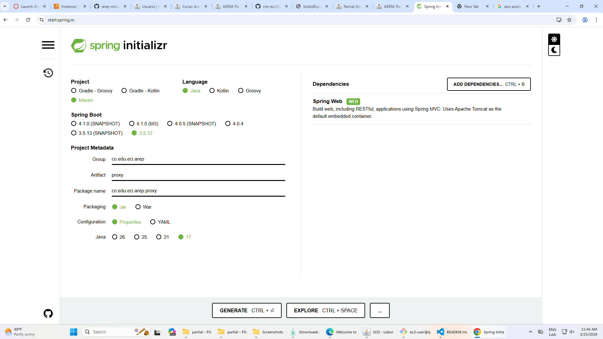

Now we have the two projects, in both cases we are going to create controllers, match service for the computing logig and the proxy for the petition handler. 

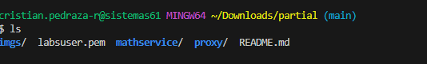

Once we have them, we add the port server configurtion 8080 in both application.properties and now we can check that everything is working by running these commands.

```bash
# Terminal 1
cd mathservice && PORT=8081 mvn spring-boot:run
```
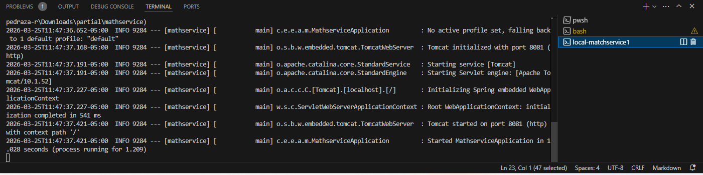

```bash
# Terminal 2
cd mathservice && PORT=8082 mvn spring-boot:run
```
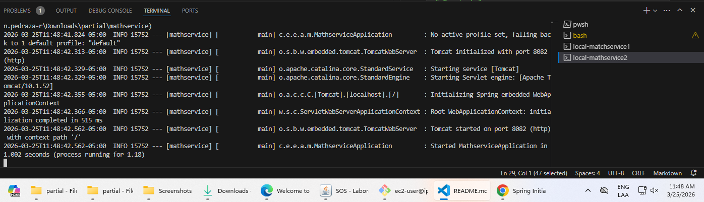

```bash
# Terminal 3
cd proxy
export INSTANCE1_URL=http://localhost:8081
export INSTANCE2_URL=http://localhost:8082
cd proxy && mvn spring-boot:run
```
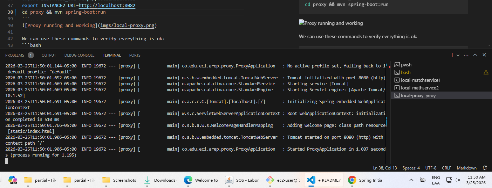

We can use these commands to verify everything is ok:
```bash
curl "http://localhost:8081/lucasseq?value=10"      # direct
curl "http://localhost:8080/proxy/lucasseq?value=10" # through proxy
```

Now, we are going to 
kill mathservice1, run again the curls and it should still work via mathservice2

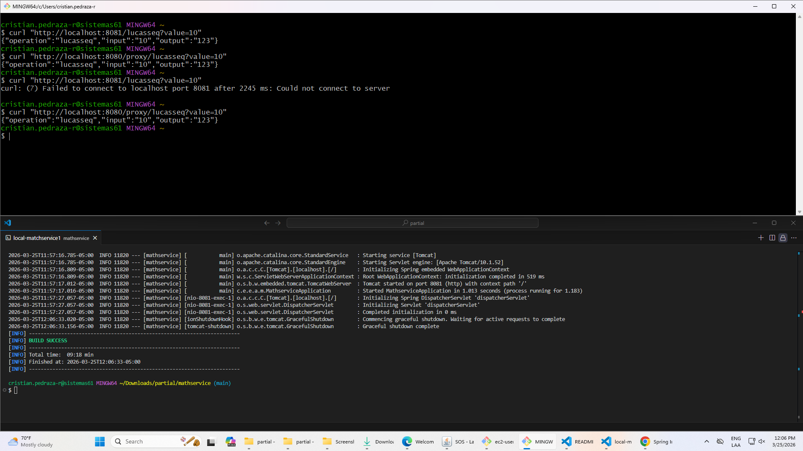

### Creating the jars in each service
```bash
mvn package -DskipTests
mvn package -DskipTests
```
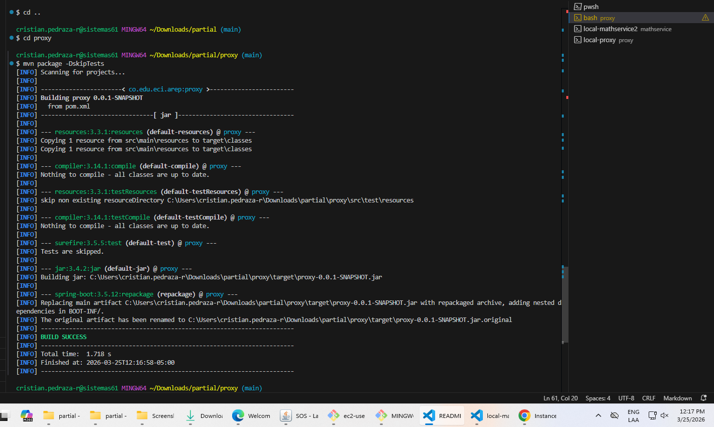
# AWS Deployment

First, we need to create 3 EC2 instances with free tier features, each of them must have a custom tcp inboundaring rule that allows the 8080 port. 

- **Mathservice 1**
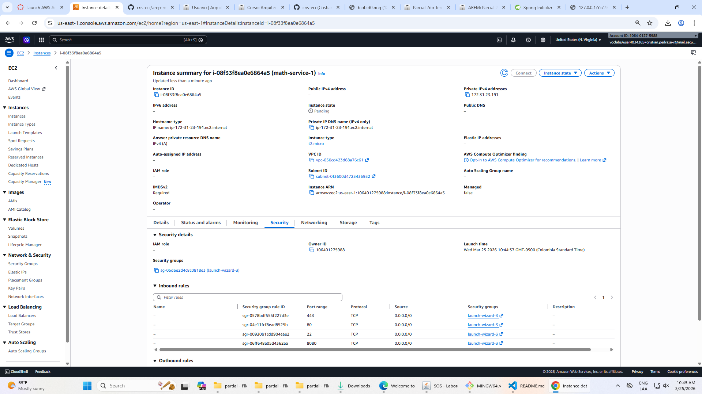

- **Mathservice 2**
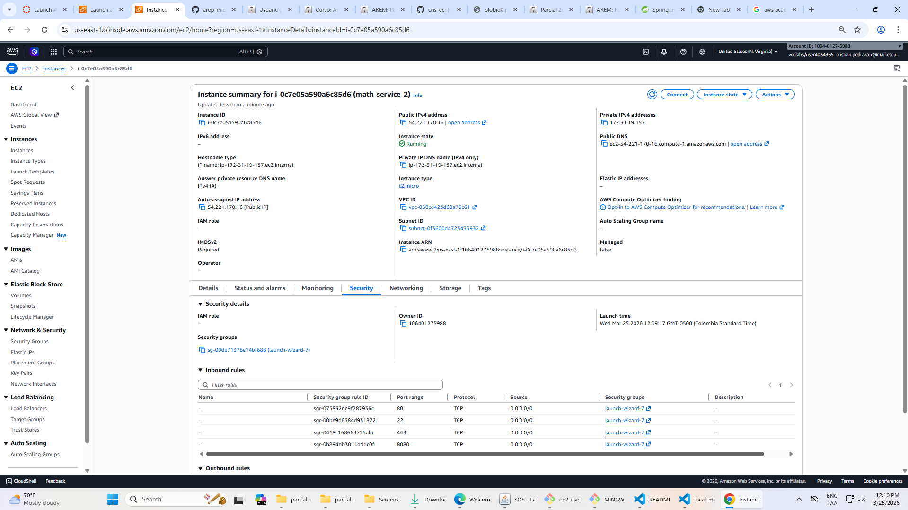


- **Proxy**
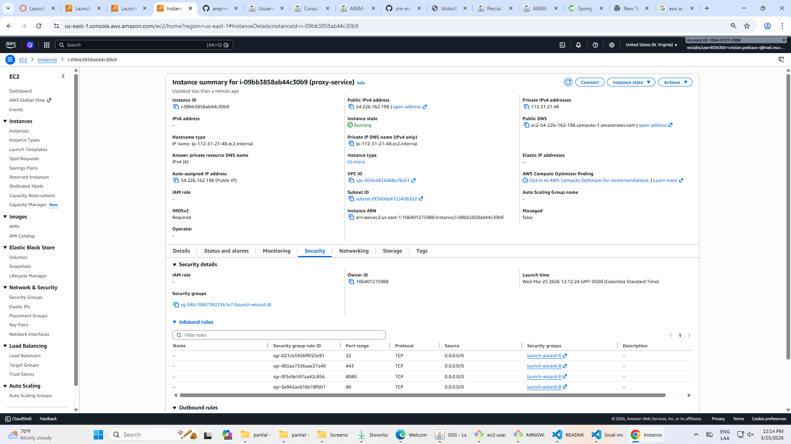


- **Three intances running**
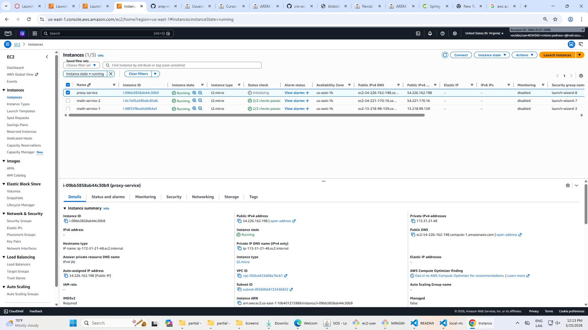


# Conecting and uploading jars to each instance using sc

### Math service 1
```bash
scp -i labsuser.pem mathservice/target/mathservice-0.0.1-SNAPSHOT.jar ec2-user@54.221.170.16:~/
ssh -i labsuser.pem ec2-user@54.221.170.16

sudo yum install java-17-amazon-corretto -y
java -jar mathservice-0.0.1-SNAPSHOT.jar &
```
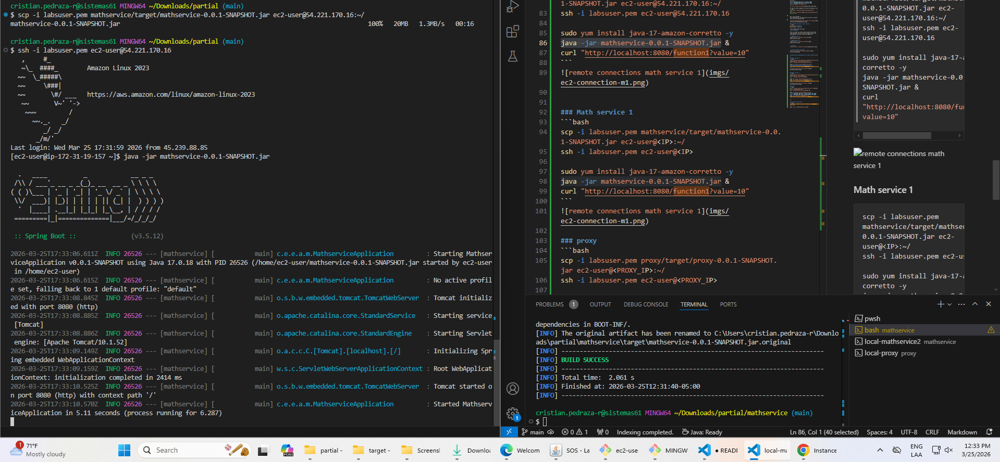


### Math service 2
```bash
scp -i labsuser.pem mathservice/target/mathservice-0.0.1-SNAPSHOT.jar ec2-user@13.218.99.139:~/
ssh -i labsuser.pem ec2-user@13.218.99.139

sudo yum install java-17-amazon-corretto -y
java -jar mathservice-0.0.1-SNAPSHOT.jar &
```


### proxy
```bash
scp -i labsuser.pem proxy/target/proxy-0.0.1-SNAPSHOT.jar ec2-user@54.226.162.198:~/
ssh -i labsuser.pem ec2-user@54.226.162.198

sudo yum install java-17-amazon-corretto -y
export INSTANCE1_URL=http://54.221.170.16:8080
export INSTANCE2_URL=http://13.218.99.139:8080
java -jar proxy-0.0.1-SNAPSHOT.jar
```
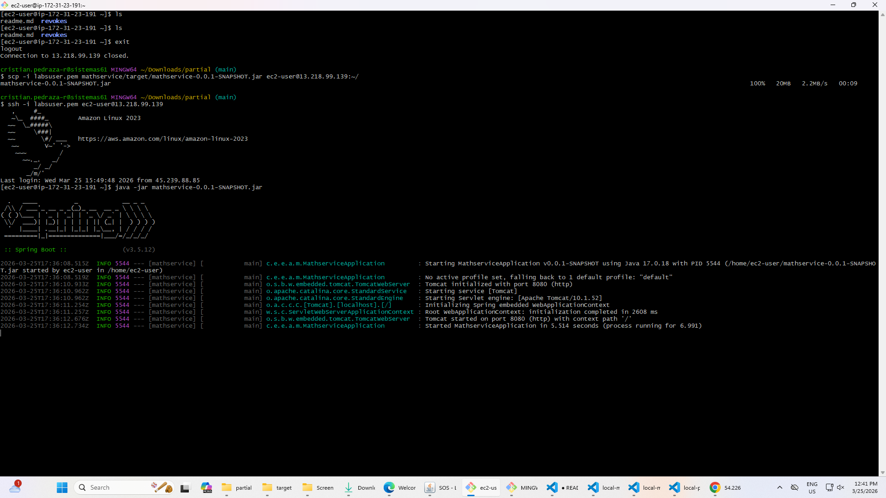

---

## 9. Verify and record
Open `http://54.226.162.198:8080` or `http://ec2-54-226-162-198.compute-1.amazonaws.com:8080/` in browser
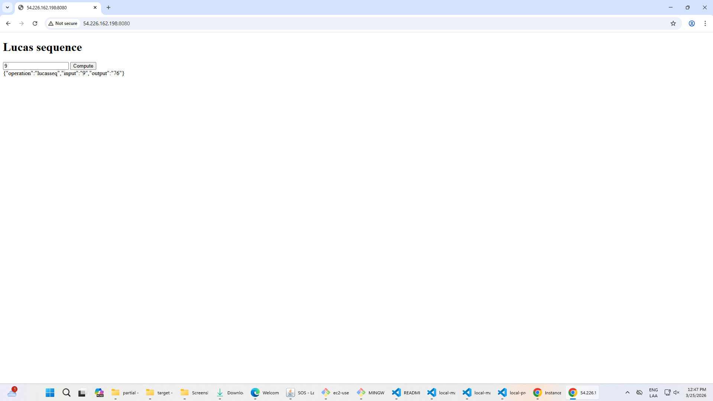

[Video of implementation](https://drive.google.com/file/d/1MoOIKGbhGN3myeL7PXO-BBQ0V_JwRUzF/view?usp=sharing)